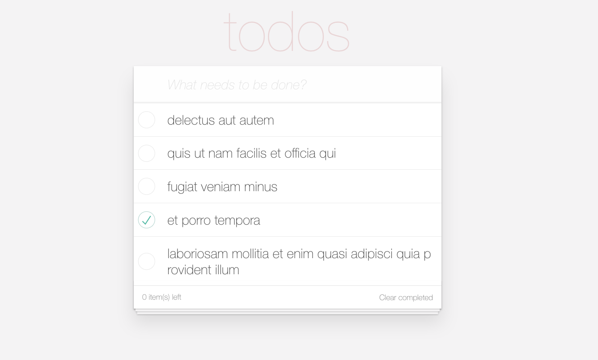

# Assessment: Todos, Part I

For this assessment and the one that follows, you'll be creating a todo list application:


In doing so, you'll be demonstrating a basic understanding of the following:

- converting simple HTML mark up to JSX
- passing read-only values to components using props
- understanding when React props differ from their HTML attribute equivalents (such as `className`)

## Getting Started
To get started, _fork_ this repository into your own GitHub account then clone
this repository to your local machine:

```console
foo@bar:~ $ git clone git@github.com:github-username/todos-part-1
foo@bar:~ $ cd todos-part-1
foo@bar:~/todos-part-1 $
```

Note `github-username` above. In other words, __don't__ simply copy-paste the
code above blindly into a terminal. 

This repository comes with a couple of directories already:

- assets: This includes an `index.html`, `todos.json`, and a `index.css` that
  will be used to base your React components off of.
- screenshots: This includes the gif files that demonstrates the fully
  functioning application (we won't get there today, be patient!)

You'll need to create a react application in a new directory (as the above files will cause `create-react-app` to complain):

```console
foo@bar:~/todos-part-1 $ create-react-app todos
foo@bar:~/todos-part-1 $ cd todos
```


Once there, make sure that the scaffold React application works:

```console
foo@bar:~/todos-part-1 $ yarn start
```

## Acceptance Criteria

### Step 1 (1 point): Move [assets/index.css](assets/index.css) to `src/index.css`
This stylesheet will be read by `src/index.js` and used to style the todo
application.

### Step 2 (1 point): Move [assets/todos.json](assets/todos.json) to `src/todos.json`
Once you've moved `assets/todos.json`, add an import to the top of `App.js`
so that you can access its contents:

```jsx
import todoList from './todos.json';
```

You'll now be able to iterate over the individual todos in `todoList`.

### Step 3: Convert [assets/index.html](assets/index.html) into JSX
Your first task will be to convert [assets/index.html](assets/index.html) to
JSX. 

Take a minute to look over the file and get familiar with the mock up. We'll
then explain how we'd like you to break the HTML down into React components.

When doing so, consider [assets/index.html](assets/index.html) once more, and
answer the following questions:
- Does any HTML element appear to be the "root" of the todo app?
- Does any HTML element appear to be the "root" of the todo list?
- Does any HTML element appear to represent an individual todo item

Hint: The answer to the first two of these should be pretty obvious, but the
third may be a bit tricky.

#### Step 3a (3 points): Create a `TodoItem` component 
Create a `TodoItem` component that renders an individual todo item. It's up
to you to determine what props it can take, but here are some hints to get started:

- It should be possible to pass in the text to be displayed on the todo item.
- It should be possible to pass in whether or not the item has been completed

#### Step 3b (3 points): Create a `TodoList` component

Next, you'll need to write `TodoList` component which can take an array of
todos and render them. We recommend that you map over the `todoList` array
and generate `TodoItems` for each object within it as children of `TodoList`.
Something like the following would do the trick:

```jsx
{this.state.todos.map( todo => <TodoItem /* some props go here */ /> )}
```

Astute readers may have noticed that the example above uses
`this.state.todos` instead of `todoList` directly. This is because we will be
adding to the todo list in the future, so would like the component to keep
track of current todos. We can't mutate state in React, so it won't do to
just append to the `todoList` array..

#### Step 3c (2 points): Use your `TodoList` component inside of the `App` component

All that remains is to use the `TodoList` component inside of the `App` component.

Hint: If you answered the first two questions above about
[assets/index.html](assets/index.html), the reason for separating the `App`
and `TodoList` components should become apparent.

## Final Product
Here is a screenshot of what your app should look like at this point. You can type in the input, but there is no actual functionality implemented.


## Submission

You __will__ be required to submit a deployed application today. If you instead
submit a link to a GitHub repository (that is, only code), you _will_ be awarded
__0__ points.
